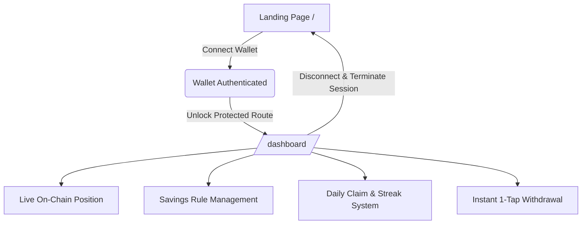

# 🌿 Sage — Project Progress & Architecture Roadmap

> **Your G$ grows itself.** Non-custodial savings & DeFi yield automation for GoodDollar claimers on Celo.

---

## 📌 1. Project Overview

Sage is an automated, non-custodial micro-savings and yield-generating protocol designed specifically for the GoodDollar (G$) ecosystem on Celo. Every time a user claims their daily Universal Basic Income (UBI), Sage intercepts a customizable percentage (1% to 50%), converts it to stable collateral (`cUSD`) via Mento Exchange, and deposits it directly into Aave V3 lending pools on Celo to earn compounding yield.

### Core Ecosystem Integrations
- **GoodDollar (G$)**: Daily UBI distribution protocol and token standard.
- **Mento Protocol**: Decentralized multi-currency exchange for seamless on-chain G$ ↔ cUSD swaps.
- **Aave V3 on Celo**: Lending protocol for real compound interest on supplied stable collateral.
- **Celo Layer 2**: High-throughput, carbon-negative blockchain infrastructure with ultra-low transaction fees.
- **MiniPay & GoodWallet**: Lightweight mobile wallet integrations.

---

## 🏛️ 2. Smart Contract Architecture

| Contract | Network | Address / Status | Description |
| :--- | :--- | :--- | :--- |
| **`SageVault.sol`** | Celo Sepolia | `0x765951171682073c94814B00482a1a0FBa2d7011` | Non-custodial vault managing claim interception, Mento swaps, Aave V3 yield supply, and 1-tap withdrawals. |
| **`GoodDollar (G$)`** | Celo Sepolia | `0x62B8B11039FcfE5aB0C56E502b1C372A3d2a9c7A` | ERC-20 token contract on Celo. |
| **`Mento Broker`** | Celo Sepolia | Configured via `contract.ts` | Router for executing stable swaps between G$ and cUSD. |
| **`Aave V3 Pool`** | Celo Sepolia | Configured via `contract.ts` | Lending pool managing `aToken` yield accrual. |

---

## 🚀 3. End-to-End Progress Matrix



### Feature Implementation Status

| Feature | Status | Notes |
| :--- | :---: | :--- |
| **Privy Identity & Wallet Migration** | ✅ Done | Privy provider, canonical wallet resolution, viem execution layer. |
| **Real-Time Yield Ticker** | ✅ Done | Sub-second micro-yield compounding calculations with animated ticker. |
| **Micro-Yield Streak Booster** | ✅ Done | Tiered APY based on streak milestones (Silver 4.4%, Gold 4.7%, Diamond 5.2%). |
| **36-Hour Grace Window** | ✅ Done | Rolling 36h check-in window logic to protect daily streaks from breaking. |
| **Dual-Currency Withdrawal** | ✅ Done | Choose between receiving G$ or USDT yield collateral via Mento swap. |
| **Shareable Milestone Cards for X** | ✅ Done | Social milestone generator with 1-click Twitter / Farcaster intents. |
| **Referral Program & Multi-Tier Bonus** | ✅ Done | Unique referral links (`?ref=0x...`) with Tier 1 (+5%) & Tier 2 (+2%) downlines. |
| **Opt-In Top Savers Leaderboard** | ✅ Done | Top savers ranking modal with pseudonymous address privacy toggle. |
| **Withdrawal-Proof Trust Feed** | ✅ Done | Celoscan verified transaction links on all recent activities. |
| **Claim-Time Agent Nudge** | ⏸️ On Hold | Placed on hold per user request. |
| **Decoupled Viem Execution** | ✅ Complete | Verified | Viem remains the blockchain execution and RPC layer. `WalletClient` is instantiated on-demand with active chain verification and signer security invariants. |
| **Landing Page Experience** | ✅ Complete | Verified | Glassmorphic design, `UnicornBackground`, responsive hero, interactive product preview, fee comparison matrix, and story carousel. |
| **Authentic Partner Stack** | ✅ Complete | Verified | Borderless logo grid (`GoodDollar`, `Aave`, `Celo`, `Mento`, `MiniPay`, `GoodWallet`, `cUSD`) with radial glass luminescence hover effect. |
| **Strict Route Protection** | ✅ Complete | Verified | `/dashboard` is strictly guarded. Unauthenticated direct access redirects to `/`. Connecting wallet securely unlocks `/dashboard`. |
| **Clean Auth Termination** | ✅ Complete | Verified | Disconnecting terminates Privy session, resets transient on-chain state, and returns to landing page. |
| **Celebratory Claim Modal** | ✅ Complete | Verified | Replaced native browser alerts with custom celebratory modal featuring confetti particle physics and streak multipliers. |
| **Interactive Sidebar & Branding** | ✅ Complete | Verified | Collapsible rail with hover-swap animation between `sage_S_logo_Dark.png` and expand icon; expanded view renders `sageLogoDark.png`. |
| **1-Tap Instant Withdrawal** | ✅ Complete | Verified | Converts Aave cUSD position back to G$ in one transaction with live USDT/G$ rate quoting. |
| **Typography & Copy Polish** | ✅ Complete | Verified | Clean typography with all em dashes removed end-to-end across codebase. |
| **Website Favicon & Metadata** | ✅ Complete | Verified | Favicon and touch icons updated to the official Sage logo asset. |

---

## 📂 4. Repository Structure & Directory Map

```text
Sage/
├── contracts/
│   └── SageVault.sol             # Core Solidity vault contract
├── public/
│   ├── assets/
│   │   ├── sageLogoDark.png      # Full horizontal brand wordmark
│   │   └── sage_S_logo_Dark.png  # Compact Sage 'S' brand mark
│   └── logos/                    # Authentic DeFi partner vector logos
├── src/
│   ├── components/
│   │   ├── dashboard/            # Specialized dashboard widgets & feed
│   │   └── landing/              # Modular landing page sections
│   │       ├── FeatureGrid.tsx   # Visual feature breakdown
│   │       ├── FinalCta.tsx      # Bottom conversion banner
│   │       ├── HowSavingWorks.tsx# 3-Tier savings plan & table
│   │       ├── Integrations.tsx  # Partner stack logo grid
│   │       ├── LandingFooter.tsx # Responsive footer
│   │       ├── LandingHero.tsx   # Main hero with interactive rule slider
│   │       ├── LandingNav.tsx    # Header with container-aligned navigation
│   │       └── ProductPreview.tsx# Live preview mockup
│   ├── views/
│   │   ├── DashboardView.tsx     # Fullscreen protected dashboard
│   │   └── SetupView.tsx         # Public landing page view
│   ├── config.ts                 # Chain & contract configurations
│   ├── contract.ts               # Viem contract reads/writes & quoting
│   ├── mockData.ts               # Clean default initial states
│   ├── types.ts                  # TypeScript interfaces
│   ├── App.tsx                   # Root state router & route guardian
│   ├── landing.css               # Comprehensive landing & dashboard CSS
│   └── styles.css                # Base utility styles
├── index.html                    # HTML5 entry with metadata & favicon
├── PROJECT_PROGRESS.md           # End-to-end project status & roadmap
├── package.json                  # Scripts & dependencies
└── vite.config.ts                # Vite build configuration
```

---

## 🛠️ 5. Running & Building the Project

### Prerequisites
- **Node.js**: v18.0+
- **Package Manager**: npm or yarn

### Available Scripts

```bash
# 1. Install dependencies
npm install

# 2. Run local development server
npm run dev

# 3. Typecheck and build production bundle
npm run build

# 4. Preview production build locally
npm run preview
```

---

## 🎯 6. Next Steps & Future Roadmap

1. **Automated Subgraph / Indexer**: Deploy an Envoy / The Graph indexing layer on Celo to query historical claim transactions and volume analytics in real-time.
2. **Push Protocol / MiniPay Notifications**: Mobile push notifications when daily GoodDollar claims become available.
3. **Multi-Asset Vault Diversification**: Support additional Celo native yield strategies (e.g. Mento cEUR / cREAL pools).
