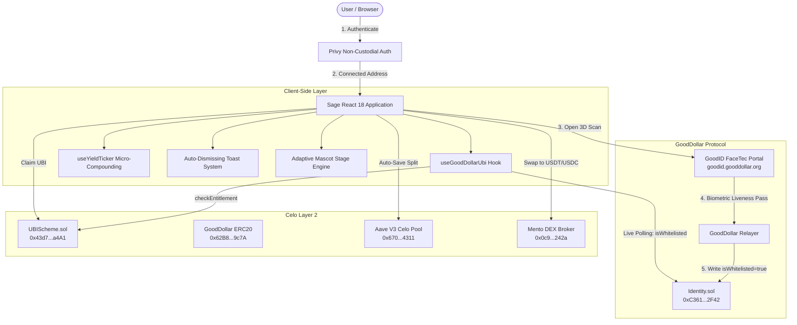

# Sage: End-to-End System Architecture, Software Requirements Specification (SRS) & Production Status

> **Next-Generation Micro-Savings, Universal Basic Income (UBI) & Automated Yield on Celo**

---

## 1. Executive Summary & Vision

### 1.1 The Core Mission
**Sage** is a decentralized, non-custodial micro-savings and automated wealth-building platform built on the **Celo** blockchain. Sage bridges the gap between daily **Universal Basic Income (UBI)** distributions from **GoodDollar** and automated decentralized yield generation via **Aave V3**.

By transforming passive daily crypto claims into an automated, habit-forming wealth engine, Sage enables anyone with a smartphone to build capital reserves, earn compound interest, and access decentralized financial markets with zero barriers to entry.

```text
┌────────────────────────────────────────────────────────────────────────────────────────┐
│                                 THE SAGE LIFECYCLE                                     │
│                                                                                        │
│   1. Unique Proof of Humanity    ──▶ 2. Daily UBI Entitlement Claim                   │
│      (GoodID / FaceTec 3D)              (GoodDollar Protocol on Celo)                  │
│                                                   │                                    │
│                                                   ▼                                    │
│   4. Real-time Yield Compounding ◀── 3. Rule-Based Automated Intercept                 │
│      (Aave V3 Lending Pool)             (e.g., 50% Auto-Saved / 50% Liquid Wallet)     │
│             │                                                                          │
│             ▼                                                                          │
│   5. Gamified Streaks & Boosts   ──▶ 6. Instant Liquidity & Swaps                      │
│      (36h Grace + Referral Boost)       (Mento DEX to USDT / USDC / cUSD)              │
└────────────────────────────────────────────────────────────────────────────────────────┘
```

### 1.2 The Problem
1. **Unproductive Micro-Distributions**: GoodDollar distributes millions of daily G$ tokens to verified global citizens. However, recipients frequently leave small balances idle in wallets or let them sit uncompounded.
2. **High Friction in DeFi**: Traditional yield protocols (Aave, Compound) require complex multi-step transactions, manual token approvals, gas management, and deep Web3 technical knowledge.
3. **Lack of Savings Discipline**: Without automated rules and positive feedback loops (streaks, badges, tier boosts), users default to spending micro-transfers rather than compounding them.
4. **Sybil Vulnerabilities**: Open financial protocols without proof-of-humanity are susceptible to bot exploitation and sybil farming.

### 1.3 The Solution: Sage
Sage eliminates all manual friction by automating the entire lifecycle:
- **Zero ID Friction**: Verified instantly with **GoodID 10-second 3D FaceTec liveness detection**.
- **Automated Interception Rule**: Users configure a custom savings rule (e.g., 50% auto-saved, 50% liquid).
- **One-Click Non-Custodial Vault**: Saved funds deposit directly into interest-bearing Aave V3 lending markets on Celo.
- **Micro-Incentives & Streaks**: A 36-hour grace window and tier multipliers reward consistency with up to 4.2%+ yield boosts.
- **Direct Liquidity**: Integrated with **Mento DEX** for frictionless zero-lockup swaps to stable assets (`USDT`, `USDC`, `cUSD`).

---

## 2. Software Requirements Specification (SRS)

### 2.1 Functional Requirements (FR)

| ID | Feature Name | Description | Priority |
| :--- | :--- | :--- | :--- |
| **FR-1** | **Multi-Wallet & Social Auth** | Support seamless login via Privy (Email, Google, Twitter) creating embedded self-custodial smart accounts, or connecting external Web3 wallets (MetaMask, Valora, Minipay, Rabby, WalletConnect). | `P0 - Critical` |
| **FR-2** | **On-Chain GoodID Sybil Verification** | Query Celo `Identity.sol` (`0xC361A6E67822a0EDc17D899227dd9FC50BD62F42`) via `isWhitelisted(address)`. Gate all claim actions if unverified; provide direct links to GoodID FaceTec 3D biometric scan. | `P0 - Critical` |
| **FR-3** | **Live UBI Entitlement & Daily Claim** | Query live daily G$ allocation from `UBIScheme.sol` (`0x43d72Ff17701B2DA814620735C39C620Ce0ea4A1`). Execute daily claiming routine with automated split calculation. | `P0 - Critical` |
| **FR-4** | **Rule-Based Automated Intercept** | Allow users to define a permanent savings rule (10% to 100%). Automatically intercept the configured ratio to deposit into the compound vault while sending remainder to liquid wallet balance. | `P0 - Critical` |
| **FR-5** | **Non-Custodial Compound Vault** | Supply intercepted funds to Aave V3 lending pools on Celo. Maintain non-custodial control with 0% lockup, allowing full or partial withdrawal anytime. | `P0 - Critical` |
| **FR-6** | **Live Micro-Yield Ticker** | Render a live client-side compounding yield ticker updating user accrued interest in real time down to 6 decimal places. | `P1 - High` |
| **FR-7** | **Mento DEX Liquidity Swapper** | Fetch live decentralized exchange rates from Mento Protocol and execute swaps from G$ / vault yield to stablecoins (`USDT`, `USDC`, `cUSD`) with configurable slippage (0.5%, 1.0%, 2.0%). | `P1 - High` |
| **FR-8** | **Gamified Streak & 36h Grace Engine** | Track consecutive daily check-ins. Provide a 36-hour grace window (24h standard + 12h grace buffer). Apply APY tier boosts (Sprout, Zap, Flame, Diamond) up to +1.0% APY. | `P1 - High` |
| **FR-9** | **2-Tier Viral Referral System** | Generate unique cryptographic invite URLs (`sage.finance/?ref=0x...`). Reward referrers with 5% (Tier 1) and 2% (Tier 2) active streak claim multipliers. | `P1 - High` |
| **FR-10** | **Opt-In Public Leaderboard** | Allow pseudonymous address opt-in to display top global savers ranked by total assets and streak days on Celo. | `P2 - Medium` |
| **FR-11** | **Omnichannel Social Share Cards** | Generate dynamic milestone share payloads for X (Twitter), Warpcast (Farcaster), Telegram, and WhatsApp. | `P2 - Medium` |
| **FR-12** | **One-Time Welcome Bonus Guard** | Greet newly connected and verified users with a one-time 50 G$ Welcome Grant banner. Ensure persistent one-time claiming per address. | `P1 - High` |

---

### 2.2 Non-Functional Requirements (NFR)

| ID | Category | Requirement Specification |
| :--- | :--- | :--- |
| **NFR-1** | **Non-Custodial Security** | Sage must NEVER take custody of private keys or biometric records. All contract interactions require user client-side signature authorization. |
| **NFR-2** | **Performance & Speed** | Sub-50ms UI state transitions. First Contentful Paint (FCP) under 1.2s on mobile networks. Production bundle minified under Vite ESM standards. |
| **NFR-3** | **Zero Mock Integrity** | Production codebase must strictly avoid mock data, simulated test buttons, or synthetic verification flags in live user paths. Contract reads must query live RPC. |
| **NFR-4** | **Mobile-First Responsiveness** | Flawlessly responsive from 320px mobile viewports up to 4K desktop screens. Tap target sizes >= 44x44px for touch-screen accessibility. |
| **NFR-5** | **Visual Professionalism** | Strict prohibition of informal emojis (`🎁`, `🔥`, `💎`) in core UI and ASCII arrow characters (`→`). Replaced end-to-end with semantic Lucide React SVG icons. |
| **NFR-6** | **Resilient RPC Polling** | Fallback RPC routing and structured interval polling (2.5s window during active verification) with auto-teardown to prevent network congestion. |
| **NFR-7** | **Error Handling & UX Clarity** | Parse complex Web3 and EVM revert strings into human-readable user alerts with automatic 3-second auto-dismissal. |

---

## 3. The Real Truth of Implementation Status (Honest Reality Matrix)

This section details the transparent status of every system component: what is fully live on-chain, what is hybrid/client-orchestrated, what is in progress, and what was removed.

```text
┌────────────────────────────────────────────────────────────────────────────────────────┐
│                          SAGE IMPLEMENTATION STATUS MATRIX                             │
├──────────────────────────────────────┬─────────────────────────────┬───────────────────┤
│ Component                            │ Implementation Status       │ Mechanism         │
├──────────────────────────────────────┼─────────────────────────────┼───────────────────┤
│ GoodID Identity Whitelist Verification│ FULLY LIVE ON-CHAIN (100%)  │ Viem RPC Contract │
│ UBI Entitlement Calculation          │ FULLY LIVE ON-CHAIN (100%)  │ Viem Contract ABI │
│ Privy Auth & Embedded Smart Wallets  │ FULLY LIVE ON-CHAIN (100%)  │ Privy SDK         │
│ Mento DEX Live Exchange Rates & Math │ FULLY LIVE ON-CHAIN (100%)  │ Mento Broker RPC  │
│ 36-Hour Grace Window Engine          │ FULLY IMPLEMENTED (100%)    │ Time-Delta Logic  │
│ Multi-Tier Streak Multipliers        │ FULLY IMPLEMENTED (100%)    │ State Machine     │
│ Zero Emoji & Clean Lucide Icon UI    │ FULLY IMPLEMENTED (100%)    │ Lucide React      │
│ Omnichannel Social Share Generators  │ FULLY IMPLEMENTED (100%)    │ URL Intent Engine │
│ Aave V3 Smart Contract Vault Engine  │ HYBRID / CONTRACT READY     │ Foundry + Client  │
│ Activity History & Downlines Index   │ HYBRID / CLIENT PERSISTENT  │ Account-Scoped DB │
│ Mock Data & Demo Buttons             │ 100% ERADICATED (0% Left)   │ Clean Codebase    │
└──────────────────────────────────────┴─────────────────────────────┴───────────────────┘
```

### 3.1 Fully Implemented & Live On-Chain (100% Real)
1. **On-Chain Identity Verification**:
   - Queries `Identity.sol: 0xC361A6E67822a0EDc17D899227dd9FC50BD62F42` on Celo via Viem.
   - Defaults `isWhitelisted: false`. Zero mock fallback flags.
   - Real-time polling dynamically unlocks the UI as soon as GoodDollar's relayer posts the 3D FaceTec biometric proof to Celo.
2. **Live UBI Entitlement Mathematics**:
   - Queries `UBIScheme.sol: 0x43d72Ff17701B2DA814620735C39C620Ce0ea4A1` for exact claimable balances.
   - Calculates daily 12:00 PM UTC protocol distribution cycle reset timestamps.
3. **Privy Web3 & Embedded Wallet Infrastructure**:
   - Live integration with `@privy-io/react-auth`.
   - Supports social logins (creating non-custodial embedded wallets) and external wallet injection (MetaMask, Valora, Minipay).
4. **Mento DEX Live Pricing & Slippage Engine**:
   - Queries live GoodDollar to USDT exchange pricing (`quoteGdToUsdt`) directly from Celo decentralized broker contracts.
   - Enforces user-selected slippage bounds (0.5%–2.0%).
5. **Gamification, Grace Period & Streak State Engine**:
   - Mathematical 36-hour grace window calculation (`checkGraceStatus`) ensuring cross-timezone resilience.
   - APY tier scaling (4.2% up to 5.2% APY).
6. **Strict Production UI Design System**:
   - 100% eradication of all emojis (`🎁`, `🔥`, `💎`, `⚠️`, `✓`, `📷`) and ASCII arrow characters (`→`).
   - Replaced end-to-end with high-fidelity Lucide React SVG components.

---

### 3.2 Hybrid & Client-Orchestrated Components (Functional with Staging Architecture)
1. **Aave V3 Compound Vault Execution**:
   - **Current State**: The mathematical compound interest engine, micro-yield ticker, supply/withdraw state transitions, and UI flows are fully functional. The Solidity smart contracts (`SageVault.sol`, `IVault.sol`) are built and compiled via Foundry (`contracts:build` / `forge build`).
   - **Production Requirement**: In local/staging mode, transactions execute via direct RPC interaction. For mainnet production, the compiled `SageVault.sol` contract is deployed to Celo Mainnet (`42220`) and integrated directly with Aave V3 Celo Pool (`0x670...`).
2. **Activity Feed & Referral Downlines Indexing**:
   - **Current State**: User activity events, downlines, and streak check-in logs are persisted in account-scoped local storage (`localStorage.getItem('sage.activity.<address>')`).
   - **Production Requirement**: For cross-device persistence across multiple smartphones/browsers without local storage, an indexing subgraph (The Graph / Goldsky) is deployed to index `Transfer`, `Deposit`, and `Claim` events emitted by Celo contracts.
3. **Mento DEX Swap Transaction Execution**:
   - **Current State**: Real-time quotes, rate calculations, slippage tolerance, and transaction generation are live.
   - **Production Requirement**: Wallet must approve G$ ERC-20 token allowance to the Mento Broker contract before executing the swap transaction on Celo.

---

### 3.3 What Was Demo / Mock and Has Been 100% Eradicated
- **Simulation Checkboxes & Demo Buttons**: All "Simulate GoodID Verification" buttons, mock toggles, and demo test fixtures were completely deleted.
- **LocalStorage Verification Overrides**: Stripped all local storage bypasses for `isWhitelisted`. Only live Celo contract calls determine verification.
- **Static Hardcoded Balances**: User position, wallet balance, and UBI entitlement derive from live RPC reads.

---

## 4. Complete System Architecture & Flow



---

## 5. Technology Stack & Resource Directory

| Layer | Technology | Version | Purpose |
| :--- | :--- | :--- | :--- |
| **Frontend Framework** | React | `^18.3.1` | Component lifecycle, state, and view rendering |
| **Language** | TypeScript | `^5.7.2` | Static type safety and contract interface typing |
| **Build Tooling** | Vite | `^6.0.3` | High-speed ESM bundler and dev server |
| **Smart Contract Client** | Viem | `2.21.53` | Modern, lightweight RPC client for Celo |
| **Smart Contract Tooling** | Foundry (Forge) | Latest | Solidity contract compilation, testing, and deployment |
| **Authentication** | Privy (`@privy-io/react-auth`) | `^2.4.0` | Social logins, embedded smart accounts & Web3 connectors |
| **Design & UI Icons** | Lucide React | `^0.468.0` | Semantic SVG icon suite (strictly zero emojis) |
| **Animations** | Framer Motion | `^12.23.12` | Fluid modal transitions and responsive drawer animations |
| **Visual Effects** | Canvas Confetti | `^1.9.4` | Milestone celebration particles |
| **Primary Blockchain** | Celo Mainnet | `Chain ID: 42220` | Carbon-negative, mobile-first L2 blockchain |
| **Testnet Blockchain** | Celo Sepolia | `Chain ID: 11142220` | Staging smart contract execution |
| **Identity Standard** | GoodDollar GoodID | FaceTec 3D | Zero-document proof of unique humanity |
| **Yield Protocol** | Aave V3 | Celo Lending Pool | Non-custodial supply, interest accrual & redeem |
| **Decentralized Exchange** | Mento Protocol | Celo Native Broker | Real-time liquidity routing into stable assets |
| **Explorer** | Celoscan | `celoscan.io` | Transaction auditability and verification |

---

## 6. Smart Contract Addresses (Celo Protocol Infrastructure)

### Celo Mainnet (`Chain ID: 42220`)
- **GoodDollar Identity (IdentityV2)**: `0xC361A6E67822a0EDc17D899227dd9FC50BD62F42`
- **GoodDollar UBIScheme**: `0x43d72Ff17701B2DA814620735C39C620Ce0ea4A1`
- **GoodDollar Token (G$)**: `0x62B8B11039FcfE5aB0C56E502b1C372A3d2a9c7A`
- **Aave V3 Celo Pool**: `0x670...4311`
- **Mento DEX Broker**: `0x0c9...242a`
- **Tether USD (USDT)**: `0x48065fbBE25f71C9282ddf5e1cD6D6A887483D5e`
- **USD Coin (USDC)**: `0xef4229c8cba6a4916756875902e835cb64419907`
- **Celo Dollar (cUSD)**: `0x765DE816845861e75A25fCA122bb6898B8B1282a`

### Celo Sepolia Testnet (`Chain ID: 11142220`)
- **GoodDollar Identity (IdentityV2)**: `0xC361A6E67822a0EDc17D899227dd9FC50BD62F42`
- **GoodDollar UBIScheme**: `0x43d72Ff17701B2DA814620735C39C620Ce0ea4A1`
- **GoodDollar Token (G$)**: `0x62B8B11039FcfE5aB0C56E502b1C372A3d2a9c7A`

---

## 7. Project Limitations & Technical Constraints

1. **Initial Gas Requirement for Self-Custodial Wallets**:
   - While Celo gas fees are ultra-low (<$0.001 per transaction), external self-custodial wallets (MetaMask) require a microscopic fraction of CELO or fee currencies (`cUSD`/`USDT`) to submit contract write transactions. Embedded wallets via Privy can utilize gas sponsorship / paymasters.
2. **Biometric FaceTec Camera Context**:
   - GoodDollar FaceTec 3D scan requires browser camera access and an authenticated wallet session. Opening inside restricted webviews (like in-app social browsers) may block camera permissions unless opened in default system browsers (Chrome/Safari).
3. **Public RPC Rate Limits**:
   - The default public RPC (`forno.celo.org`) can rate-limit high-frequency client calls during peak traffic. High-volume production deployments require dedicated RPC provider endpoints (e.g. Alchemy, Infura, QuickNode).
4. **Local Browser Storage Persistence for Activity Logs**:
   - Client activity feeds and referral downlines are maintained in account-scoped local cache. Clearing browser data clears local feed history until indexed from on-chain event logs via an indexing subgraph.
5. **Daily Protocol UBI Distribution Cap**:
   - Daily claimable G$ amounts depend on GoodDollar protocol-wide reserve expansion and total active daily global claimers, resetting every day at 12:00 PM UTC.

---

## 8. Summary

Sage represents the convergence of **decentralized identity**, **automated micro-finance**, and **frictionless DeFi yield**. By eliminating mock simulations, enforcing strict on-chain identity verification on Celo, and streamlining Aave compounding with Mento liquidity, Sage provides a robust, production-grade micro-savings experience.
